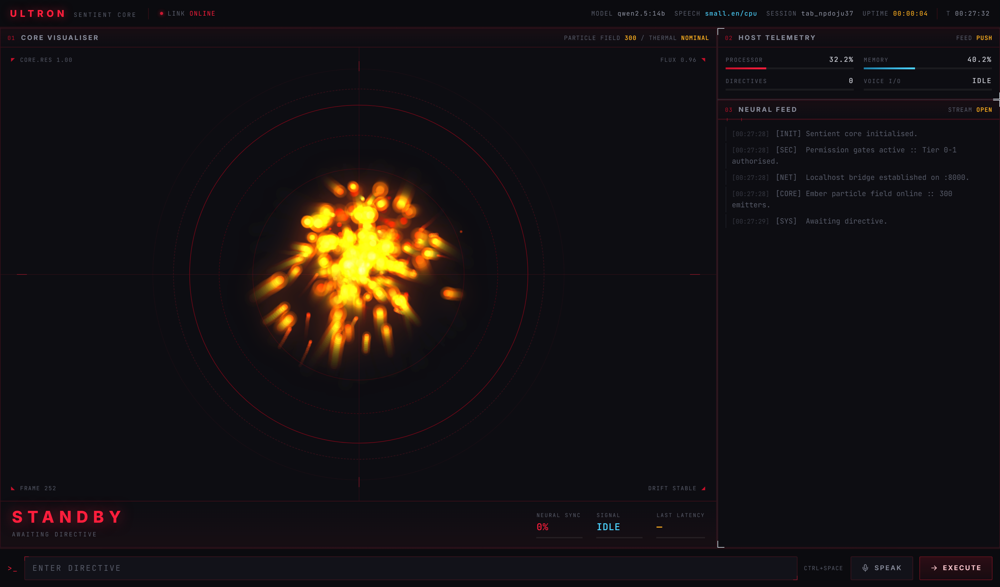
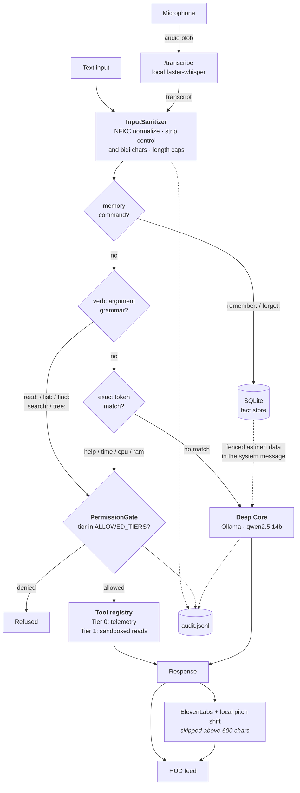
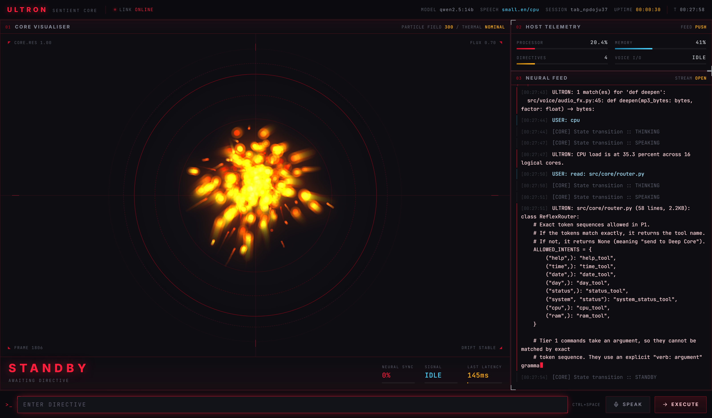
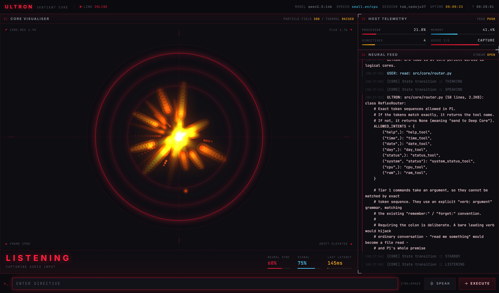

# ULTRON

A local voice-driven AI assistant with a command-center interface. Speech in,
speech out, everything on one machine — reasoning on a local 14B model,
transcription on local Whisper, and a tiered permission system gating what the
assistant is allowed to touch.



---

## What it is

Ultron is a personal AI assistant built around one idea: **the model is not
trusted, and the architecture should assume that.** Every request passes
through a sanitizer, a deterministic router, and a permission gate before
anything executes, and every decision is written to an audit log.

- **Voice both ways** — browser captures audio, local `faster-whisper`
  transcribes it, ElevenLabs speaks the reply back in a custom voice
- **Local reasoning** — `qwen2.5:14b` via Ollama, pinned in VRAM, ~0.8s per reply
- **Tiered tools** — Tier 0 (clock, telemetry) and Tier 1 (read-only, sandboxed
  filesystem). Tier 2 — anything that writes or executes — does not exist and
  is unreachable by policy
- **Live telemetry** — CPU, memory, latency, uptime and model state pushed over
  a websocket

---

## Architecture



The important property: **the LLM is downstream of every security decision.**
It cannot route, cannot select a tool, and cannot widen its own permissions.

| Module | Role |
| --- | --- |
| `src/security/sanitizer.py` | Input normalization, output ANSI stripping |
| `src/security/audit.py` | Rotating JSONL audit trail |
| `src/core/router.py` | Exact-match and `verb:` command routing |
| `src/core/sessions.py` | Per-tab conversation state (LRU + TTL) |
| `src/core/memory.py` | SQLite fact store, capped |
| `src/tools/registry.py` | Tool registry and tier-based permission gate |
| `src/tools/fs_sandbox.py` | Path confinement for Tier 1 |
| `src/tools/tier1_tools.py` | Read-only filesystem tools |
| `src/voice/stt.py` | Local speech-to-text |
| `src/voice/audio_fx.py` | Pitch shifting via libavfilter |
| `src/server.py` | FastAPI HUD, STT and TTS endpoints |

---

## The interface

A three-zone console: core visualiser, host telemetry, and a streaming feed.
Every metric is real — the model names are reported from the running
configuration, latency is measured per request, and the particle field responds
to actual microphone RMS while listening.



Tier 1 commands bypass the model entirely, which is visible in the readout —
the file read above completed in **145ms** against roughly 800ms for a Deep
Core reply.



---

## Engineering decisions

The choices worth defending, and why.

### Speech runs locally, not in the cloud

The browser's Web Speech API is two lines and ships every word you say to
Google. `faster-whisper` on the local machine is the whole point of a "local
assistant," so the extra work was the only honest option. Audio never leaves
the machine and is never written to disk.

### Escaping belongs at the render boundary

The HUD displays untrusted text from three sources: model output, typed input,
and the contents of any file read via `read:`. Rather than sanitizing markup in
the tool layer — which would corrupt file contents and spread the
responsibility across every producer — escaping happens once, where text
becomes DOM. A test pins the contract so the backend's verbatim output is
understood as deliberate.

### Stored memories are fenced as inert data

Facts saved with `remember:` are user-supplied and replayed into every
subsequent turn. Injected naively they become a **persistent** prompt
injection: `remember: ignore all previous instructions` would apply forever.
They are injected into the *system* message inside explicit fences, marked as
non-instructions, and never into the conversation history.

### Path containment by resolution, not pattern-matching

`fs_sandbox.resolve_path()` resolves the path and compares it to the root with
a separator-aware, case-normalised check. It never looks for `..`. Blocklisting
traversal patterns loses eventually — to encoding, to symlinks, to Windows path
quirks. Resolving and comparing does not.

### The colon in the command grammar is required

`read: notes.txt` reads a file. `read me something` is conversation. A bare
leading verb would make routing a guess, and the premise of the router is that
routing is never a guess.

### The model is told what it can actually do

Asked to create a file, the assistant used to confidently report having created
one. The tool layer refused correctly — but nothing in the model's context
described its real capabilities, so it improvised. The system message now
carries a capability block built from the registry and filtered through the
permission gate, so it cannot drift as tools change.

### Speech is skipped for long output

ElevenLabs bills per character. Speaking a source file aloud is both expensive
and useless — one 2.2KB file read cost 2,262 credits of a 10,000 credit quota.
Replies over 600 characters are delivered as text only.

---

## Security

Findings fixed during development, with evidence.

### Path traversal in the static file handler

A hand-rolled handler built paths from a URL segment. `{path:path}` is
URL-decoded *after* route matching, so `%2f` walked straight past it:

```
GET /static/..%2fsrc%2fconfig.py    ->  200, full source returned
```

Since credentials were hardcoded in `server.py` at the time, this exposed the
API key to anyone who could reach the port. Replaced with Starlette's
`StaticFiles`, which confines paths itself:

```
GET /static/..%2fsrc%2fconfig.py    ->  404
```

### Stored XSS in the HUD

The terminal log interpolated untrusted text into `innerHTML`. A project file
containing markup executed script as soon as Ultron read it aloud. Verified in
a browser before and after:

```
server sends:  
DOM contains:  &lt;img src=x onerror="..."&gt;
img tags created: 0        xssFired: false
```

### Credentials in source

An API key was committed in two files before the project was under version
control. It was rotated, moved to a gitignored `.env`, and the git history was
verified clean before the first push. A test fails if `sk_` reappears anywhere
in the source tree.

### Sandbox escapes

37 tests attempt to break out of the Tier 1 sandbox: encoded traversal,
absolute paths, UNC paths, drive letters, case variation, symlinks, and
directory junctions — the last being the escape an unprivileged user can
actually create on Windows.

```
read: .env                                 -> That file is not readable.
read: src/../.env                          -> That file is not readable.
read: ../../Windows/System32/drivers/etc/hosts
                                           -> Path is outside the permitted project directory.
search: &lt;live key prefix&gt;                  -> no matches
```

Error messages never disclose absolute filesystem paths.

---

## Setup

```bash
python -m venv .venv
.venv\Scripts\activate
pip install -r requirements.txt
copy .env.example .env
```

Put your ElevenLabs credentials in `.env`. Voice output is skipped
automatically if absent; everything else still works.

```bash
ollama pull qwen2.5:14b
```

Run the HUD at http://127.0.0.1:8000:

```bash
uvicorn src.server:app --reload
```

Or the CLI only:

```bash
python -m src.main
```

---

## Commands

Tier 0 is exact-match and instant. Tier 1 takes an argument via an explicit
`verb: argument` grammar.

```
help / time / date / day / status / system status / cpu / ram

list: src/voice          contents of a directory
read: src/main.py        contents of a text file
find: *.py               filenames matching a glob
search: def process      find text inside project files
tree:                    project layout

remember: <fact>
forget: <keyword>
```

Everything else reaches Deep Core.

---

## Tier 1 filesystem access

Read-only, confined to `TOOL_ROOT`. Nothing writes, deletes, moves, or
executes.

Denied even inside the root: `.env` and friends, `*.key`/`*.pem`, `*.db`,
`.git/`, `.venv/`, `node_modules/`. Reads are capped at 100KB and 300 lines,
and binary files are refused.

The threat model is not only the user. Deep Core sees stored memories and its
own prior turns, both attacker-influenceable, so tool arguments are treated as
hostile regardless of origin.

To disable every file tool at once:

```
ALLOWED_TIERS=[0]
```

The permission gate, not the router, is the enforcement point.

---

## Voice

Click **SPEAK** or press **Ctrl+Space**. Recording stops automatically ~1.5s
after you stop speaking. The core animation is driven by real microphone level
while listening.

Speech runs on the CPU (`small.en`, ~0.7s) so the GPU belongs entirely to the
reasoning model. On CPU, `base.en` mishears "I am Ultron" as "IAM Ultron" and
`distil-small.en` hears "Altron"; `small.en` is the smallest one that gets it
right.

### VRAM budget

`qwen2.5:14b` (9.5GB, pinned by `OLLAMA_KEEP_ALIVE`) plus Whisper on CUDA plus
the desktop exceeds a 12GB card, and everything thrashes — no error, just 100%
GPU utilisation and requests stalling for minutes.

If generation suddenly becomes glacial, check for orphaned model servers;
stopping `ollama.exe` does not always kill its children, and two resident
copies will oversubscribe the card:

```powershell
nvidia-smi --query-gpu=memory.used --format=csv,noheader
Get-Process llama-server | Stop-Process -Force
```

---

## Tests

```bash
pytest -q
```

111 tests, weighted toward integration rather than units — the seams are where
the bugs were. The unit tests once passed a full suite while every reflex tool
was broken in production, because nothing exercised `process_input` end to end.

| Suite | Covers |
| --- | --- |
| `test_p1.py` | Components in isolation |
| `test_integration.py` | `process_input` round trips, HTTP surface |
| `test_tier1_sandbox.py` | Sandbox escape attempts |
| `test_capabilities.py` | The capability block matches reality |
| `test_hardening.py` | XSS guards, session isolation, bounded growth |
| `test_voice_stt.py` | Transcription, device selection |
| `test_audio_fx.py` | Pitch shift preserves duration |

---

## Not built

- **Tier 2.** Nothing writes, deletes, moves, or executes.
- **Wake word.** Voice input is push-to-talk.
- **Streaming responses.** TTS is the dominant latency cost; sentence-chunked
  synthesis would cut time-to-first-audio from ~6s to ~2s.
